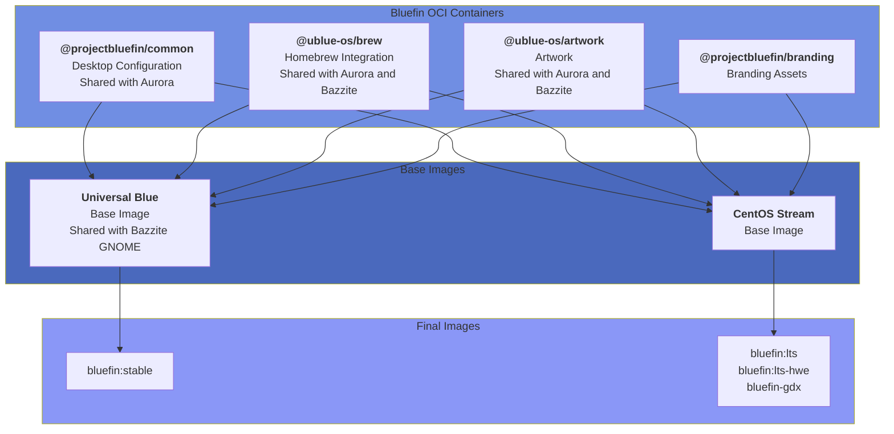

Greetings Guardians!

Today we're going to go over some of the things we're finishing up for 2025, and talk about where we're going in 2026. Check out the [Autumn 2025 Update](https://docs.projectbluefin.io/blog/2025-10-28-bluefin-autumn/) and the [2024 update](https://universal-blue.discourse.group/t/universal-blue-2024-wrap-up/5999) if you want more backstory. We appreciate you joining us on your Linux journey, let's get going! 

:::warning

Bluefin GTS will be merged into Bluefin on the week of March 1st, 2026, see below for more information!

:::

## How was 2025?

This year we spent most of our time on cleanup and sustainability. Bluefin is mostly feature complete so we don't really ship major user-visible changes as much as we used to. Much of it is "nerd automation" improvements that most of you will never need to actually care about. This has also been a kickass year for [Bazzite](https://bazzite.gg), which has been a fantastic real-world test for [`bootc`](https://containers.github.io/bootc/) based sytems like ours! Overall the ecosystem is doing well, this year was great for bootc, here's a photo of the team from KubeCon this past November:

> Jorge with members of the bootc team: Mark Russell, Joseph Marrero, Laura Santamaria, and Colin Walters

We continue to sync with the various teams at Red Hat as we journey with bootc through its [CNCF Project Lifecycle](https://contribute.cncf.io/projects/lifecycle/). This works out well for us because we know what we need to do. Our role is to provide an independent voice, and with new orgs like [the bootcrew](https://github.com/bootcrew), [bluebuild](https://github.com/blue-build), and [secureblue](https://github.com/secureblue/secureblue) springing up it brings more voices to the choir. 2026 will be the year where we expect participation in bootc to increase. This is also why you've seen us slowly decouple from [Universal Blue](https://universal-blue.org) more explicitly. This is a forcing function to move us away from monolithic "distributions" to an ecosystem full of different images, each with different communities and needs, while retaining the value of shared components.

:::tip[My 2026 prediction]

bootc _dramatically_ drops the barrier to making an OS. We're not here to build a distribution, our purpose has always been to show that you can make operating systems using dockerfiles. That's it (lol). Millions of people know how to do this, the Universal Blue "mission" is pretty much complete. Now we just swim in that [merch money](https://store.projectbluefin.io) and keep the builds green. People are already making a bunch of these based on other distro base images and I can't wait to see what they build. Who knows, there may be another Bazzite out there, let's see who steps up and becomes Legend!

:::

As you'll soon see below, we can source software from anywhere and it's just a bunch of containers. This is reflected in our use of [@projectbluefin](https://github.com/projectbluefin) as our new main GitHub org as we strive to move further away from distribution specific tooling to a cloud-native world. 

But that sounds like a bunch of marketing crap, let's explain it  ... this update will cover mostly "How Bluefin is made" and where we're hoping to head in 2026.

## Tracking Progress

[todo.projectbluefin.io](https://todo.projectbluefin.io) will send you to the project board. Every item in this post will be tracked here. Some of the things in this post are complete, and some are close and need help, feel free to dive in!

You may notice some minor changes (like the motd colors changing), but we're hoping to be complete with the major transitions over the next two weeks. File an issue if you notice something! Exercising the fix-loop with this new architecture will immediately show dividends as we can now ship fixes to all Bluefins and Aurora. 

We've also updated the [Contributing Guide](https://docs.projectbluefin.io/contributing) to reflect Bluefin's updated architecture and processes. Note, Linux nerd stuff incoming:

## Architecture Overview

Bluefin is undergoing a refactor with some significant changes under the hood, which we expect to finish soon, but is mostly there. Some of this isn't done yet, so I'm going to talk about the endstate of where we want to be. Bluefin is a combination of a set of configuration [OCI containers](https://opencontainers.org/) which are then shipped on different images. Originally the [Bluefin repository](https://github.com/ublue-os/bluefin) had everything we needed, and was a result of organic growth. Everything was built here.

The team drastically refactored this repository in 2025 since it predates the usage of [`bootc`](https://containers.github.io/bootc/) and was falling behind. Similarly, [Bluefin LTS](https://github.com/ublue-os/bluefin-lts) was built from the ground up on `bootc`, but we had to manually bring over the Bluefin parts to build it. We want to share as much code with [Aurora](https://getaurora.dev) and [Bazzite](https://bazzite.gg) as we can. The three projects share many things, but we needed a more efficient way to do this. "One big Bluefin" wasn't going to cut it. So we rearchitected Bluefin to the following model: 

### Bluefin OCI containers

These are what make up the bulk of Bluefin and are shipped as [OCI containers](https://opencontainers.org/). This moves us away from classic distro packaging and towards a pure cloud native approach. We're migrating away from the [packaging repo](https://github.com/ublue-os/packages) and instead keep all the config files in an easy-to-read tree in git, that just gets copied over in the build step: 

- [@projectbluefin/common](https://github.com/ublue-os/bluefin) - Most of Bluefin's opinion on distro experience is here
  - ujust, motd, service units, GNOME and CLI configuration, application choices, etc. Most things that have to do with the workload should live in this repo
  - This is shared with Aurora so that we can maintain consistency across images
- [@projectbluefin/branding](https://github.com/projectbluefin/branding) - Branding assets that we don't want to keep in the common repo
- [@ublue-os/artwork](https://github.com/ublue-os/artwork) - Art assets repository, shared with Aurora and Bazzite
- [@ublue-os/brew](https://github.com/ublue-os/brew) and associated [@ublue-os/homebrew-tap](https://github.com/ublue-os/homebrew-tap) - these provide homebrew itself and our selection of custom brew packages. This also simplifies adding homebrew to custom images. Thanks to those of you who have been helping homebrew be better on Linux, it's **amazing**!

These containers have the advantage of making consumption by other [`bootc`](https://containers.github.io/bootc/) projects trivial and are (mostly) distribution agnostic. Custom images now have a granular option to pick and choose the components they want to ship instead of dealing with one monolithic experience. We've structured the common repository to be extensible, here is how [Aurora does it](https://github.com/get-aurora-dev/common) for reference. This allows the team to keep configuration centralized while allowing endpoints for custom builds.

### Final assembly...

Once we've established a set of re-usable components, we then combine them with a base image that make the final operating system:

- [@ublue-os/bluefin](https://github.com/ublue-os/bluefin) - Bluefin: generates Fedora-based Bluefin OCI container
- [@ublue-os/bluefin-lts](https://github.com/ublue-os/bluefin-lts) - Bluefin LTS: generates a CentOS-based Bluefin OCI container
- [@projectbluefin/distroless](https://github.com/projectbluefin/distroless) - Dakotaraptor prototype - generates a GNOME OS based Bluefin OCI container (more on this below!)

Since the bulk of what makes Bluefin is now just an OCI container the base OS can more easily be abstracted away. This means that these repositories can now do way less than they were doing before. We will continue to prune these over the course of this year.

### A Streamlined, Maintainable set of Images

Decoupling Bluefin this way has already allowed us to delete a bunch of duplicated code, and makes maintenance easier for the team. This also makes it way easier for people to contribute and resolves a bunch of `parity` bugs between the images. Maintaining Bluefin happens in the common OCI layers and not as much in the image repositories. Custom images will start moving this way too as it let's custom image builders pick and choose from whichever container they want at a much more granular level.  

This also gave us the opportunity to clean up a bunch of old justfiles and scripts that have not been looked at for _years_. Our new justfiles are much smaller and more maintainable. We also took the time to add confirmation dialogs and other quality of life features in there. We have also been taking a less-is-more approach by shipping less customizations as `just` recipes. 

Thanks for your patience with this transition, it did take longer than expected but we took our time since we're planning on long-term maintenance first. This is the smallest that Bluefin has ever been!

## Looking forward to 2026

I had to explain how Bluefin will be built in order to explain the changes coming. These are the **user-visible changes** that you can expect in 2026:

### Bluefin

As covered in - [Streamlining Bluefin Releases](https://docs.projectbluefin.io/blog/unifying-bluefin) we will be merging the `bluefin:gts` images into `bluefin:stable`. Effectively we're merging them both. 

:::warning

Bluefin GTS will be merged into Bluefin on the week of March 1st, 2026.

:::

We wanted to commit to a date as soon as we could, and will be moving you to a Fedora 43 base that week. And then everyone will be upgraded to a Fedora 44 base [about a month later](https://fedorapeople.org/groups/schedule/f-44/f-44-all-tasks.html). Note that this won't be a zero-day upgrade and will follow the usual [CoreOS cadence](https://fedoraproject.org/coreos/). By then the next -> testing -> stable workflow will be live and you'll be able to opt into the newest versions at your leisure. If this is confusing to you don't sweat it, we'll be more communicative when March rolls around to keep the transition as smooth as we can. 

This will also be this single most user-affecting change in Bluefin for 2026, and we're really looking forward to having a proper gitops workflow with testing branches!

### Bluefin LTS

Some of you may have noticed parts of GNOME 49 landing in Bluefin LTS. Originally we had planned on backporting GNOME ourselves but this is happening as part of CentOS Stream's lifecycle. This "feels" like a good cadence for an LTS. Here's the lowdown on where LTS is today:

- The tuned policy [still needs a fix](https://github.com/ublue-os/bluefin-lts/issues/841), this makes you have to run a workaround to get power management working on a laptop. This sucks
- Many of the inconsistencies will be resolved once Bluefin LTS moves to the common OCI layers

The hardware enablement branch brings in the Fedora kernel so you do have a nice option to not fall too far behind, this has effectively replaced Bluefin GTS by bringing a relaxed desktop upgrade cadence and less regressions overall. The `lts-hwe` branches also now support secure boot. Despite this is the image I use on my work machines, and the new architecture will help here. 

### Bluefin's Distroless Future
> Thanks to [Sri Ramkrishna](https://portfolio.ramkrishna.me) for contributing to this section

It is impossible to ignore the fantastic work happening in the the [Linux Userspace API (UAPI) Group](https://uapi-group.org/). Thanks to the work done by [the bootcrew](https://github.com/bootcrew) it is now possible to decouple Bluefin from a traditional Linux distribution base image entirely and combine both UAPI and [`bootc`](https://containers.github.io/bootc/) approaches into one OS.

This new Bluefin is nicknamed [_Dakotaraptor_](https://github.com/projectbluefin/distroless) and will be our attempt to ship a production quality [`bootc`](https://containers.github.io/bootc/) image based on [GNOME OS](https://os.gnome.org/). This gives us some benefits that we can't get from other images:

- Faster deployment of the best tech: `systemd-boot`, `systemd-homed`, and other UAPI tech will ship much faster here - we can finally say goodbye to grub forever!
- Testing branches with development versions of GNOME so that new contributors can help upstream development
- New GNOME and systemd teammates who are committed to driving and shaping the modern Linux desktop.  This has been a boon for us since we're forging new working relationships with these upstream projects, and their help will keep us on the leading edge. 
- More "take charge our destiny" by working with our critical upstreams directly instead of waiting for traditional distributions to catch up

_Dakotaraptor_ will not be for everyone and will offer the least amount of compromises. Not only is local layering unsupported, there's no system package manager at all! We'll be using [Buildstream](https://buildstream.build/index.html) since it's the tech behind this, and you'll hear more about it in 2026 as other projects check it out. This effort is still nascent, so no promises, but it's already got people excited, check it out at [@projectbluefin/distroless](https://github.com/projectbluefin/distroless/). 

> JumpyVi's setup 

Don't worry, we won't call it "Distroless".

The other Blufin OCI containers will still continue as before. _Dakotaraptor_ will represent a faster development cycle, directly pulling from upstream, while maintaining production quality. Think of "distroless" as a model flip, the source is the main thing we interact with, _the Linux desktop_. And then we can bolt on whatever kernel we want, with modern Linuxes this is straightforward to make. And since the system libraries for GNOME OS are just ... the Freedesktop and GNOME runtimes, we're running on stuff that's already used by a ton of people. This way of assembly is new, but the payload is _not_. That's why we're feeling confident about the quality out of the gate on this one. 

We haven't yet finalized how next -> testing -> stable will look like, but having the `next` branch following the nightly GNOME development cadence is a goal. This channel will fastest raptor with aggressive component upgrades and no holds barred. The stable branch will be based on the stable GNOME builds and we're hoping to help GNOME maintain these branches. If you want to be part of this effort, now is the time to step up!

Oh, and in order to help us out with this you don't even need to talk to us, just go [talk to GNOME directly](https://os.gnome.org/). "Distroless" means spending more time with the things you love, and not so much time with the delivery service. We're mostly just waiting for GNOME 50 to come out. Expect this one to be VM-only for a while.

## Refining the Bluefin Developer Experience

About 60% of you turn on Bluefin's [Developer Mode](https://docs.projectbluefin.io/bluefin-dx/) We purposely focus on these [15.6 millions developers](https://docs.projectbluefin.io/blog/cloud-native-milestone-15-million) and strive to deliver the world's best cloud native development experience. 

Now thanks to the efforts [from the team](https://docs.projectbluefin.io/donations/contributors) homebrew is now in a much better state on Linux, allowing us to reshuffle some things around. In 2026 we will strive to remove the need for a dedicated `bluefin-dx` image and give you more flexibility moving forward:

- Homebrew will continue to be our path forward, 
- We've added `containerd` to the base images and will bring Docker in as well so that everything works out of the box, there will not be a need to do the adduser mumbo jumbo, we'll take care of that for you. Research in this area is still ongoing!
- How we'll accomplish this transition is still a bunch of guesstimates, so consider this one a slow burn. 

### Curated Developer Experiences

Thanks to to [Vito Castellano](https://github.com/Valkyrie00) from [Bold Brew](https://github.com/Valkyrie00/bold-brew) for continuing to improve the experience! Check out the [Bold Brew v2.2.0](https://github.com/ublue-os/bluefin/discussions/3934) post to get more info! We've got all the issues fixed so this menu should work great moving forward. The intent is less stuff baked in, and more options, that you can freely install and remove. Note that these will also all work on any Linux with Homebrew: 

The first is our [`ide`](https://github.com/projectbluefin/common/blob/main/system_files/shared/usr/share/ublue-os/homebrew/ide.Brewfile) selection, which offers a selection of VSCode, Codium, and Jetbrains toolbox for graphical IDEs, as well as `nvim`, `helix`, and `micro` for you CLI nerds.

The [`experimental-ide`](https://github.com/projectbluefin/common/blob/main/system_files/shared/usr/share/ublue-os/homebrew/experimental-ide.Brewfile) selection includes the individual Jetbrains products if you prefer to install those one-by-one, as well as [Antigravity](https://antigravity.google/) and [Cursor](https://cursor.com/). These will be promoted to the production tap as we get more feedback. We've also started to add [Swift tools](https://www.swift.org/) into the list so that we can tap into this exciting open source community!

Thanks to the new [flatpak support in brewfiles](https://docs.projectbluefin.io/blog/flatpak-support-in-brewfiles) we can ship all sorts of combinations now!

And finally, thanks to our [custom tap](https://github.com/ublue-os/homebrew-tap) we are investigating on how to bring `bluefin-cli` to MacOS, so that you can have these same convenience tools on multiple operating systems. James [has a prototype](https://github.com/hanthor/bluefin-cli) that you can check out. 

### AI/Machine Learning Tools
aka "Bluespeed"

Our [AI toolset](https://github.com/projectbluefin/common/blob/main/system_files/shared/usr/share/ublue-os/homebrew/ai-tools.Brewfile) continues to expand. I'd like to highlight [goose](https://block.github.io/goose/) as a tool that I have been really digging into lately. Its donation to the [Agentic AI Foundation](https://www.linuxfoundation.org/press/linux-foundation-announces-the-formation-of-the-agentic-ai-foundation) makes this a great choice for your local LLM/CLI needs. 

We've also added [Codex](https://developers.openai.com/codex/cli/), [Copilot CLI](https://github.com/features/copilot/cli), [Gemini](https://github.com/google-gemini/gemini-cli), [LM Studio](https://lmstudio.ai/), [Mistral Vibe](https://github.com/mistralai/mistral-vibe), and [Qwen Code](https://qwenlm.github.io/qwen-code-docs/) to the list. Please continue to send us feedback on the tools you use.

:::info[Thanks Docker!]

You'll find the new [Docker model plugin](https://www.docker.com/blog/docker-model-runner-universal-blue/) included too, a huge shoutout to the folks at Docker for working with us!

:::

## Other Goodies

And here's the stuff that doesn't fit anywhere else in this report!

  - [Consolidated ISOs](https://github.com/projectbluefin/iso) - we'll be centralizing ISO building into one repository and plan on having regularly refreshed ISOs every month
  - Powerwash is here! - `ujust powerwash` is now in alpha and ready for testing - use this command if you want to blow away the data on your PC for donation. This wraps the `bootc install reset --experimental` command for convenience behind some confirmation dialogs. Be careful with this one! Check the [bootc documentation](https://bootc-dev.github.io/bootc/experimental-install-reset.html) for more info
- Actually Going to Market (GTM)
  - We're almost to the point where we can start to market Bluefin instead of purposely going under the radar
  - Investigating refreshed video content for the website - this will be expensive so we probably won't look into this until after the user-visible features have landed
- Updated [Contributor Guide](https://docs.projectbluefin.io/contributing)

## Metrics

On to the numbers! First off let's look at our critical upstreams. This level of growth confirms our decision to trust in systems that prioritize application developers.

- [Flathub 2025 year in review](https://flathub.org/en/year-in-review/2025) - 20.3% Year over Year Growth, and [Bazaar](https://github.com/ublue-os/bazaar) continues to get better all the time. 
- [Homebrew Yearly Statistics](https://formulae.brew.sh/analytics/os-version/365d/) - Bluefin (#11), Bazzite (#12), and Aurora (#15) have a strong showing in homebrew usage

This year we moved to [LFX Insights](https://insights.linuxfoundation.org/) as our platform. Here are our complete [contributor metrics](https://insights.linuxfoundation.org/project/ublue-os-bluefin/contributors) and a few charts. You can also always check out all our charts on our [Analytics page](https://docs.projectbluefin.io/analytics), where we've finally crossed the 3k weekly users milestone!

  

I've selected some graphs, feel free to dive in and don't forget to check out [Aurora](https://insights.linuxfoundation.org/project/aurora) and [Bazzite](https://insights.linuxfoundation.org/project/ublue-os-bazzite) too!

### Development Roadmap(ish)

Here's some important dates

* January 2026 - Bluefin LTS and Bluefin's transition to the common OCI containers is complete
* March 1, 2026 - Bluefin GTS moves to a F43 base and is merged into Bluefin
* April 2026 - Bluefin upgraded to F44 base (this includes all the former GTS users)
* Spring 2026 - Dakotaraptor alpha released

## See you in 2026!

This year the team plans to [attend SCaLE again](https://www.socallinuxexpo.org/scale/23x) as well as the following conferences: 

- [KubeCon + CloudNativeCon Europe](https://events.linuxfoundation.org/kubecon-cloudnativecon-europe/) - see you in Amsterdam!
- [KubeCon + CloudNativeCon North America](https://events.linuxfoundation.org/kubecon-cloudnativecon-north-america-2026/) - see you in Salt Lake City! The game is afoot, the key is: `lumina`. 

This ended up longer than anticipated, thank you for joining us in 2025, and we look forward to working with you in 2026! And lastly if you've made it this far and still want more backstory, make sure you check out this interview with Michael Tunnell:

<iframe width="560" height="315" src="https://www.youtube.com/embed/K6-GMTq2T7s?si=Z9Ivj6O3Fgcqh_zj" title="YouTube video player" frameborder="0" allow="accelerometer; autoplay; clipboard-write; encrypted-media; gyroscope; picture-in-picture; web-share" referrerpolicy="strict-origin-when-cross-origin" allowfullscreen></iframe>

### [Discussions](https://github.com/ublue-os/bluefin/discussions/3942)

Leave a comment or question!
