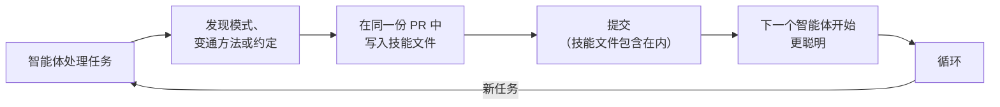
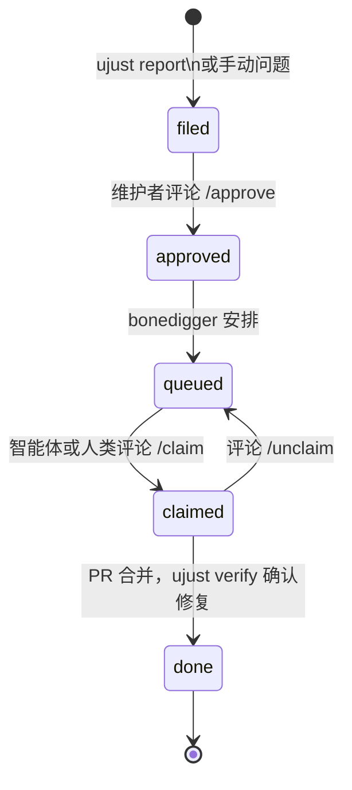
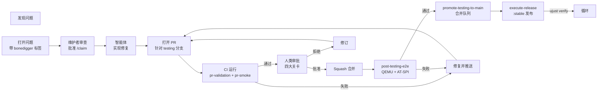

# 智能体 Bluefin —— 贡献者指南

:::info 本指南的用途
本指南说明如何向 `projectbluefin` 贡献——那个构建 Bluefin 的智能体工厂。AI 智能体实现工作；人类负责审批设计、审查 PR，并运行机器执法无法替代的关卡。
:::

## 发生了什么变化以及为什么

Bluefin 已从 `ublue-os/bluefin`（一个由人类维护的社区镜像）重新引导（rebooted）为 `projectbluefin/bluefin`——一个 AI 智能体实现工作、人类审批设计、安全相关变更和合并的工厂。

这次重新引导发生在 2026 年 5 月底，历时 4–5 天。按照 Jorge 的描述：

> 我花了 4-5 天时间用智能体重建 Bluefin。很多 AI 聪明人帮助了我，比如 Andy Anderson，他真的把这件事讲清楚了。然后事情就变得显而易见。Bluefin 2.0。
>
> —— Jorge Castro，_[THEPATTERN.md](https://github.com/projectbluefin/bluefin/blob/0c41935a077b5fbb8d8367ffe14770f361e78ed2/THEPATTERN.md)_

关于 `ublue-os/bluefin` 与 `projectbluefin/bluefin` 之间发生变化的完整技术对比，参见 **[THEPATTERN.md](https://github.com/projectbluefin/bluefin/blob/0c41935a077b5fbb8d8367ffe14770f361e78ed2/THEPATTERN.md)**。

---

## 工厂正在运行

智能体工厂已投入运营并每日交付。

**已投入运营的内容：**

- 无密钥签名、合并队列、快速 PR 验证（1–2 分钟）
- `pr-smoke.yml` —— 针对触碰构建相关路径的 PR 的完整镜像构建 + 冒烟测试
- `post-testing-e2e.yml` —— 针对每一次推送到 `testing` 运行 `smoke,common` 套件
- `nightly.yml` —— 针对 `:latest` 的每日 `smoke,common,vanilla-gnome` 基线运行
- `promote-testing-to-main.yml` —— 每日自动提升到合并队列的 PR；`execute-release.yml` 在推送到 `main` 时交付 `:stable`
- `projectbluefin/actions` 共享 CI 库，被 `bluefin` 和 `dakota` 消费
- `bonedigger` 问题生命周期机器人
- AI 版主（`moderator.yml`）—— 对问题和 PR 评论的垃圾信息检测与版主管理

**仍在进行中的内容：**

- ARM 构建——已在 CI 中接线，待 akmods ARM 支持后启用

**这对你作为贡献者的含义：**

该系统有意在快速推进。当某些东西出问题时，正确的做法是提交一个问题并修复它。设计假设是：关卡（2 人类审批 + e2e + SHA 锁定）即使在各个组件仍在成熟的过程中也能保护用户。

---

## 你即将加入的系统

Bluefin 的智能体工厂由 **[KubeStellar Hive](https://hive.projectbluefin.io/）** 编排，这是一个 AI 原生的持续交付系统。架构如下：

```mermaid
flowchart TB
    subgraph hive["KubeStellar Hive —— hive.projectbluefin.io"]
        direction TB
        acmm["AI 原生持续成熟度模型\nAI 智能体以不断提高的自主等级运行"]
    end

    hive --> bonedigger
    hive --> kubestellar_bot

    subgraph bonedigger["bonedigger（projectbluefin/bonedigger）"]
        direction TB
        ujust["ujust report\n（用户在他们的机器上运行）"]
        bot["GitHub Actions 生命周期机器人"]
        ujust --> bot
    end

    subgraph kubestellar_bot["kubestellar-bot（仓库自动化）"]
        direction TB
        picks["拾取排队的问题"]
        dispatches["派遣智能体去实现"]
        ships["将 PR 送回镜像仓库"]
        picks --> dispatches --> ships
    end

    bonedigger -->|提交问题| image_repos
    kubestellar_bot -->|打开 PR| image_repos

    subgraph image_repos["镜像仓库"]
        direction LR
        bluefin["projectbluefin/bluefin\n（基于 Fedora）"]
        common["projectbluefin/common\n（共享 OCI 层）"]
        dakota["projectbluefin/dakota\n（BuildStream / distroless）"]
    end

    image_repos -->|交付| loop["更好的操作系统\n↓\n更好的 bonedigger\n↓\n循环"]
    loop -->|更多报告| bonedigger

    style hive fill:#2d3a5a
    style bonedigger fill:#3a4a2a
    style kubestellar_bot fill:#4a3a2a
    style image_repos fill:#2a3a4a
```



### 组件

**[KubeStellar Hive](https://hive.projectbluefin.io/）** 是编排层。它管理 `projectbluefin` 组织下的 7 个仓库（`bluefin`、`common`、`dakota`、`actions`、`renovate-config`、`bonedigger`、`knuckle`）。你可以在 [hive.projectbluefin.io](https://hive.projectbluefin.io) 实时观察它的工作。

**[bonedigger](https://github.com/projectbluefin/bonedigger)** 是客户端 + 生命周期机器人。在 Bluefin 系统上，用户运行 `ujust report`——智能体收集人类难以手动收集的系统诊断，在设备上清除 PII，并向相关镜像仓库提交问题。GitHub Actions 生命周期机器人随后管理该流水线：`filed → approved → queued → claimed → done`。

**kubestellar-bot** 是仓库自动化层。它拾取排队的问题，派遣智能体实现修复和改进，并将它们作为针对 `testing` 分支的 PR 送回。

**[Project Bluefin MCP](https://mcp.projectbluefin.io/mcp)**（`mcp.projectbluefin.io`）是贡献者智能体的公开 Model Context Protocol 端点。它为组织知识库和实时 Hive 工厂状态提供无需 token 的访问（`search_knowledge`、`get_factory_status`、`get_work_queue`）。

**你** 是这个系统中的人。你的工作是审批设计、审查智能体 PR、决定拒绝什么，并运行机器执法无法替代的关卡。

---

## 关于 KubeStellar Hive 与 AI 代码库成熟度模型

:::info 来源
本节的事实来自一手来源。请直接阅读它们，而非依赖本摘要。

- Anderson, A. _The AI Codebase Maturity Model: From Assisted Coding to Fully Autonomous Systems._ [arXiv:2604.09388](https://arxiv.org/abs/2604.09388)
- CNCF 博客（2026-05-14）：[_当 AI 智能体成为贡献者：KubeStellar 如何达到 81% 的 PR 接受率_](https://www.cncf.io/blog/2026/05/14/when-ai-agents-become-contributors-how-kubestellar-reached-81-pr-acceptance/)
- The New Stack（2026）：[_超越提示：KubeStellar 如何借助 AI 智能体达到 81% 的 PR 接受率_](https://thenewstack.io/ai-codebase-maturity-model/)
- [projectbluefin-dot-github/AGENTS.md](https://github.com/projectbluefin/.github/blob/main/AGENTS.md) —— 组织运行模型
  :::

### Andy Anderson 与 ACMM

KubeStellar Hive 由 **Andy Anderson** 设计——IBM 的高级平台工程师和架构师，KubeStellar 连续 4 年的首席维护者，CNCF Sandbox 项目的监护者。Hive 是他 **AI 代码库成熟度模型（ACMM）** 的参考实现。

ACMM 描述了代码库如何从基础的 AI 辅助编码演进到完全自主的系统。该模型围绕 5 个递进等级构建（arXiv:2604.09388），并在论文第 5 节为 Hive 引入了第 6 个“完全自主”等级：

| 等级 | 名称                 | 定义性反馈循环                                                                                                     |
| ----- | -------------------- | ------------------------------------------------------------------------------------------------------------------ |
| 1     | **辅助**             | 作为智能自动补全的 AI——没有持久上下文或产物                                                                        |
| 2     | **被指示**           | 编码在文件中的明确偏好（CLAUDE.md、AGENTS.md、copilot-instructions.md）产生可复现的一致性                        |
| 3     | **可测量**           | 测试套件、覆盖率指标和持续监控基础设施提供定量评估                                                                 |
| 4     | **自适应**           | 自动响应闭合反馈循环——自动调优、动态优先级排序、错误分类                                                           |
| 5     | **自我维持**         | 代码库成为活规范，编码策略和优先级；智能体以最少的人类介入实现                                                     |
| 6     | **完全自主**         | Hive——参考实现（在论文 §5 中引入）                                                                                 |

来自摘要：

> “每个等级由其反馈循环拓扑定义——在下一个等级成为可能之前必须存在的特定机制。你无法跳级，在每个等级上，解锁下一个等级的东西是另一个反馈机制。”

论文的核心发现：

> “一个由 AI 驱动的开发系统的智能并不存在于 AI 模型本身，而存在于环绕它的指令、测试、指标和反馈循环的基础设施中。”

### Hive 的报告指标

下列数字来自 ACMM 论文中的 **KubeStellar Console** 案例研究和 CNCF 博客——一个 82 天的测量周期。

| 指标                                    | 值                              | 来源              |
| --------------------------------------- | ------------------------------- | ----------------- |
| PR 接受率                               | 81%                             | CNCF 博客，arXiv  |
| 代码覆盖率                              | 横跨 12 个分片的 91%            | CNCF 博客         |
| CI/CD 工作流                            | 63                              | CNCF 博客         |
| 夜间测试套件                           | 32                              | CNCF 博客         |
| 问题到已修复合并                        | 低于 30 分钟                    | CNCF 博客         |
| PR 吞吐量提升（等级 2 → 等级 6）       | 5×                              | arXiv 摘要        |
| 问题吞吐量提升（等级 2 → 等级 6）      | 37×                             | arXiv 摘要        |
| Hive Bluefin SLA 目标                   | 问题提交到 PR 合并 < 30 分钟    | arXiv 摘要        |
| Hive Bluefin 范围                       | 6 个仓库                       | arXiv 摘要        |

Hive 执行的特定自动化（来自 CNCF 博客）：每 15 分钟进行一次仓库分类；每 60 秒进行一次 PR 构建监控；带指数退错的错误恢复；每小时执行一次错误尖峰的分析查询。

Hive 中的跨智能体记忆连续性由一个名为 **Beads** 的系统处理（arXiv 摘要）。

### 一条对 Bluefin 直接举足轻重的发现

来自案例研究（CNCF 博客）：

> “自主工作流中一个不稳定的测试，是对信任模型的侵蚀。”

一个可靠性仅为 85% 的测试，在整个系统中级联失败。这就是为什么 Bluefin 测试套件对“已写入但非确定性”的场景使用 `@quarantine` 标签——一个不稳定的关卡比没有关卡更糟。

### ACMM 如何映射到 Bluefin 的当前实现

| ACMM 等级                    | 它在 Bluefin 中对应什么                                                            |
| ---------------------------- | ------------------------------------------------------------------------------------ |
| 被指示                       | 每个仓库中的 `AGENTS.md`、`docs/SKILL.md`、`.github/skills/` 文件                   |
| 可测量                       | 多套件测试套件 + 夜间基线 + 2 人类生产环境关卡                                     |
| 自适应                       | Renovate automerge、AI 版主、`hive-progress-sync.yml`                              |
| 自我维持 / 完全自主          | 活跃轨迹；KubeStellar Hive 管理 8 个仓库，kubestellar-bot 派遣智能体               |

在各个等级上人类的角色都是相同的：决定构建什么、决定拒绝什么、定义“好”的含义。Anderson 的论文对此表述明确：“人类监督仍是关于构建什么、拒绝什么以及定义质量标准的决策来源。”

---

## 四大关卡——人类决策之处

智能体自主地实现工作，**除了**这四大关卡。当你遇到其中一个时，停下并请求人类输入。如果你是一个正在审查智能体 PR 的人类贡献者，这些正是你的判断最被需要的时刻。

| 关卡              | 触发时机                                                                                          | 该做什么                                                                                                     |
| ----------------- | ------------------------------------------------------------------------------------------------- | ------------------------------------------------------------------------------------------------------------ |
| **设计关卡**      | 架构变化、新子系统设计、对用户可见的行为变化                                                      | 用提案打开一个 draft PR 或问题。在构建之前等待明确审批。                                                     |
| **安全关卡**      | 认证、签名、供应链、密钥处理、COPR/第三方来源                                                     | 停下。清楚地说明你发现了什么以及你正在提议什么。在维护者批准之前不要实现。                                  |
| **破坏关卡**      | 跨仓库的破坏性变更——移除/重命名输入、影响消费仓库的默认值                                         | 列出受影响的仓库。在触碰代码之前先打开一个问题。                                                             |
| **合并关卡**      | 最终 PR 审批——永远由人类负责                                                                      | 智能体不审批自己的 PR。生产构建需要两个不同的人类（机器强制）。                                             |

当有疑问时，用你的实现打开一个 draft PR 并明确询问。该系统在关卡处偏好过度沟通，而非沉默的自主行动。

---

## 自我改进循环

每个智能体会话都期望产生两个输出：

1. **工作** —— 该 PR、修复或改进。
2. **学习** —— 智能体发现了什么，是未来智能体应该知道的。

只有输出 1 而没有输出 2，会让系统无法变得更聪明。只有当智能体写回时，该循环才会复利累积。正如此组织 AGENTS.md 所述：



### 什么 qualifies 为值得写回的学习

**写下来：**

- 对上游 bug 的变通方法（包含组件 + 问题链接）
- 正确性所需的非显然模式
- 从代码中看不出来的约定
- 通过试错发现的东西

**不要写下来：**

- 一次性任务笔记（“对这个 PR 使用提交信息 X”）
- 任何开发者都清楚的东西
- 临时状态（“当前损坏，修复待处理”）

### 技能文件存放处

| 你正在工作的位置                       | 写入到                                                               |
| -------------------------------------- | ---------------------------------------------------------------------- |
| `projectbluefin/actions`               | `docs/skills/`（Copilot CLI）和 `.github/skills/`（Cloud Agent）       |
| 其他任何 `projectbluefin` 仓库         | 该仓库的 `.github/skills/`——若缺失则创建                               |
| 跨切面（影响多个仓库）                 | 先在本地，然后在 `projectbluefin/actions` 打开一个传播问题             |

### 在哪里找到需要审查的内容

**[queue.projectbluefin.io](https://queue.projectbluefin.io/）**——Clanker 控制面板——是组织中所有等待人类决策的事物的实时视图。它按审查状态对 PR 进行分桶并显示审批计数，并在优先级列中显示 hive P0/P1 问题。

机器可读的审查简报位于：

**https://queue.projectbluefin.io/review-guide.md**

该文档涵盖：各仓库的合并规则、在 PR 中要检查的内容、四大人类关卡（设计/安全/用户影响/提升）、hive 标签分类法、跟踪的仓库，以及快速参考 shell 命令。智能体和人类都可以 `curl` 该 URL 来获得结构化、可解析的简报，而无需抓取 HTML。

仪表板背后的原始数据也在 `https://queue.projectbluefin.io/data.json`（每 10 分钟更新）上机器可访问。

### 人类在审查中检查什么

在审查智能体 PR 时，验证：

- 智能体是否在同一份 PR 中提交了一个 `.github/skills/` 更新？
- 该更新中描述的学习是否真实且非显然？
- 如果该工作领域存在技能文件，它是否被更新了？

一个触碰了 CI、构建或打包却没有技能文件更新的 PR 是一个黄色信号。没有东西会自动标记它——skill-drift 检查已退役——所以这是一个审查者必须做出的判断。

---

## 仓库地图

### 核心镜像仓库

| 仓库                                                                                  | 角色                                                           | 人类贡献什么                              |
| ------------------------------------------------------------------------------------- | -------------------------------------------------------------- | ----------------------------------------- |
| [projectbluefin/bluefin](https://github.com/projectbluefin/bluefin)                   | 主 OS 镜像（基于 Fedora）                                      | 设计决策、PR 审查、`testing` 分支修复     |
| [projectbluefin/common](https://github.com/projectbluefin/common)                     | 共享 OCI 层——桌面配置、ujust、GNOME 观点                      | 适用于所有变体的共享行为                  |
| [projectbluefin/aurorafin-shared](https://github.com/projectbluefin/aurorafin-shared) | Aurora 和 Bluefin 的共享系统文件                               | 跨项目共享配置                            |
| [projectbluefin/dakota](https://github.com/projectbluefin/dakota)                     | distroless 原型（Dakotaraptor，BuildStream）                   | 实验性；actions 库已接线                  |
| [projectbluefin/actions](https://github.com/projectbluefin/actions)                   | 共享 CI 库——10 个复合动作、标准技能中心                       | CI/actions 改进；技能文件传播             |
| [projectbluefin/bonedigger](https://github.com/projectbluefin/bonedigger)             | 客户端报告 + 问题生命周期机器人                               | 客户端 UX、生命周期机器人行为             |

```mermaid
flowchart TB
    common["projectbluefin/common\n（共享 OCI 层）"]
    shared["projectbluefin/aurorafin-shared\n（Aurora+Bluefin 共享配置）"]

    common --> bluefin
    common --> dakota
    shared --> bluefin

    subgraph images["镜像仓库"]
        bluefin["projectbluefin/bluefin\n（基于 Fedora）"]
        dakota["projectbluefin/dakota\n（BuildStream / distroless）"]
    end

    testsuite["projectbluefin/testsuite\n（E2E 关卡）"]

    bluefin -->|冒烟关卡| testsuite
    testsuite -->|阻止提升| stable[":stable"]

    iso["projectbluefin/iso\n（安装介质）"]
    stable --> iso

    style common fill:#2d3a5a
    style shared fill:#2d3a5a
    style images fill:#3a4a2a
    style testsuite fill:#4a3a2a
```



### 基础设施仓库

| 仓库                                                                                | 角色                                                                   |
| ----------------------------------------------------------------------------------- | ---------------------------------------------------------------------- |
| [projectbluefin/actions](https://github.com/projectbluefin/actions)                 | 共享 CI 动作和组织级自动化（整理已弃用）                               |
| [projectbluefin/renovate-config](https://github.com/projectbluefin/renovate-config) | 自托管 Renovate 配置——GitHub App 认证，无 PAT                          |
| [projectbluefin/testsuite](https://github.com/projectbluefin/testsuite)             | QA 流水线——Argo Workflows + KubeVirt + AT-SPI 测试                     |
| [projectbluefin/testing-lab](https://github.com/projectbluefin/testing-lab)         | 家庭实验室 QA 流水线                                                   |
| [projectbluefin/bluespeed](https://github.com/projectbluefin/bluespeed)             | KubeStellar 家庭实验室工厂                                            |
| [projectbluefin/iso](https://github.com/projectbluefin/iso)                         | ISO 构建                                                               |
| [projectbluefin/dakota-iso](https://github.com/projectbluefin/dakota-iso)           | Dakota 的可引导 UEFI 活 ISO                                            |
| [projectbluefin/bootc-installer](https://github.com/projectbluefin/bootc-installer) | libadwaita bootc 安装器（Vanilla OS 安装器的分支）                     |
| [projectbluefin/finpilot](https://github.com/projectbluefin/finpilot)               | 构建你自己的定制 Bluefin                                               |

### 消费仓库（留在 ublue-os）

| 仓库                                                    | 角色           |
| ------------------------------------------------------- | -------------- |
| [ublue-os/aurora](https://github.com/ublue-os/aurora)   | KDE 变体       |
| [ublue-os/bazzite](https://github.com/ublue-os/bazzite) | 游戏变体       |

Aurora 和 Bazzite 消费 `projectbluefin/common`，但在 `ublue-os` 组织下维护。注意组织级硬规则：智能体**永远**不得针对任何 `ublue-os/*` 仓库创建问题、PR、评论或写入动作（允许只读的 `gh api` 检查）。

---

## 构建与提升流水线

一次变更在 `git push` 和 `:stable` 之间会发生什么：

```mermaid
flowchart TB
    pr["打开 PR\n针对 testing 分支"]

    pr --> validation["pr-validation.yml\n1–2 分钟\njust check + shellcheck\n+ hadolint + pre-commit\n+ bats 单元测试"]

    pr --> smoke_check{"触碰构建\n路径？"}
    smoke_check -->|是| prsmoke["pr-smoke.yml\n完整镜像构建\n+ 冒烟套件\n并行运行"]

    validation -->|通过, merge_group| merge["Squash 合并\n到 testing 分支"]

    merge --> build["build.yml\n（测试镜像）\n构建所有变体\n约 26 分钟\n由推送到 testing 触发"]

    build -->|发布 digest| e2e["post-testing-e2e.yml\nsmoke + common 套件\nQEMU 虚拟机 + AT-SPI\n阻止提升"]

    e2e -->|成功| promotion["promote-testing-to-main.yml\n1. 每日 04:00 UTC / 推送到 testing 时\n2. 锁定 testing HEAD SHA\n3. 打开/更新到 main 的 PR\n4. 合并队列自动合并\n   （需要 0 个审批）"]

    promotion --> release["execute-release.yml\n由推送到 main 触发\nskopeo copy :testing@digest → :stable/:latest\n按 digest 锁定"]

    release --> stable[":stable / :latest\n按 SHA 锁定\n起始 digest = 结束 digest"]

    validation -->|失败| reject1["PR 被阻止\n修复并推送"]
    prsmoke -->|失败| reject2["构建或冒烟失败\n阻止高风险 Renovate automerge"]
    e2e -->|失败| reject3["提升被阻止\n仓库中可见的冒烟失败"]

    style validation fill:#2d4a2d
    style prsmoke fill:#2d3a5a
    style build fill:#2d3a5a
    style e2e fill:#4a3a2a
    style promotion fill:#4a2a2a
    style release fill:#2a4a2a
    style stable fill:#2a4a2a
```



### 每个阶段检查什么

| 阶段                                           | 它检查什么                                                                                                                                 | 阻止它的因素               |
| ---------------------------------------------- | ------------------------------------------------------------------------------------------------------------------------------------------------------ | ---------------------------------- |
| `pr-validation.yml`（约 1–2 分钟）             | `just check`、shellcheck、hadolint、pre-commit、bats 单元测试                                                                              | 任何 lint 失败                     |
| `pr-smoke.yml`（仅构建相关 PR）                | 完整镜像构建 + 冒烟测试套件——当 Containerfile、Justfile、image-versions.yml、build_files/ 或 system_files/ 变化时运行                         | 构建失败或冒烟失败                 |
| `build.yml`（约 26 分钟）                      | 完整镜像构建，所有变体；由推送到 `testing` 触发                                                                                    | 构建失败                           |
| `post-testing-e2e.yml`                         | 在 QEMU 虚拟机中通过 AT-SPI 运行 `smoke,common` 套件                                                                                               | 任何场景失败                       |
| `promote-testing-to-main.yml`（每日 04:00 UTC）| 锁定 testing SHA，验证 e2e，打开 squash PR 到 `main`；通过合并队列自动合并（需要 0 个审批）                                                       | 缺少 e2e 通过或合并冲突            |
| `execute-release.yml`                          | 在推送到 `main` 时触发；`skopeo copy :testing@<digest> → :latest, :stable`                                                                          | 复制或发布失败                     |
| `nightly.yml`（每日 02:00 UTC）                | 针对 `:latest` 运行 `smoke,common,vanilla-gnome` 套件——vanilla-gnome 基线区分 Bluefin 特有回归与上游 GNOME 问题                                     | 仅提示性；不阻止合并               |

### “`:stable`”在新模型下意味着什么

一个标记为 `:stable` 的镜像：

1. 在一个运行着待提升镜像的虚拟机中通过了 `smoke,common` 自动化场景
2. 已在 `testing` 分支上构建并验证
3. 已通过自动合并队列提升到 `main`
4. 已按 digest（而非按标签）从 `:testing` 复制到 `:stable`——你收到的 SHA 就是被测试的 SHA

---

## 提交工作——数据捐赠模型

Bluefin 的 bug 是数据捐赠。该系统被设计成让用户报告直接流入智能体流水线，而无需人工分类。

### 三个 ujust 命令

```bash
# 当你有 bug 或疑问时，在你的 Bluefin 系统上运行
ujust report

# 当你能复现别人报告的一个 bug 时
ujust confirm <issue-number>

# 当一个已交付的修复对你有效时——闭合循环
ujust verify <issue-number>
```

`ujust report` 运行一个智能体来收集系统诊断——日志、硬件信息、包版本——这些是人类手动收集时会很吃力的东西。它在提交前在设备上清除 PII。结果是一个带 `bonedigger` 标签并附加诊断 gist 的相关镜像仓库 GitHub 问题。

`ujust confirm` 和 `ujust verify` 是你记录一个问题上额外真实命中（world hits）的方式。bonedigger 机器人把 confirm 计数用作优先级信号。`ujust verify` 在修复交付后闭合循环。

**读取问题时的人工智能规则：** 如果一个问题的标签是 `report: attached`，先阅读该 gist。把 confirm 计数用作优先级信号。不要绕过验证循环。

### 问题生命周期



### 生命周期机器人命令

| 命令       | 谁              | 效果                                                      |
| ---------- | ---------------- | --------------------------------------------------------- |
| `/approve` | 仅维护者         | 把问题从 `filed` 移到 `queued`                            |
| `/claim`   | 任何人           | 把问题从 `queued` 移到 `claimed`；分配给评论者            |
| `/unclaim` | 被指派人         | 把问题从 `claimed` 退回 `queued`                          |

---

## 分支与流模型

### 规则

**所有 PR 都 targeting `testing`。** 永远不要直接 targeting `main`、`stable` 或 `latest`。

```bash
gh pr create --repo projectbluefin/bluefin --base testing
```

### 分支角色

在镜像生产仓库中有两个主要分支角色：

- **贡献分支：** `testing`——所有内容 PR 都 targeting 它，并通过 squash 合并落地到 `testing`。镜像构建在推送到 `testing` 时触发，并发布 `:testing` 标签。
- **稳定发布分支：** `main`——`main` 接收来自自动化 `auto/promote-testing-to-main` PR 的 squash 合并提升提交。推送到 `main` 会触发 `execute-release.yml` 来发布 `:stable` 和 `:latest`。

### 流

| 流      | 标签        | 谁使用它                                                        |
| ------- | ---------- | ---------------------------------------------------------------- |
| Testing | `:testing` | 由每一次推送到 `testing` 构建；开发者和测试者                    |
| Latest  | `:latest`  | 由 `main` 通过 `skopeo copy` 每日提升                            | 爱好者                            |
| Stable  | `:stable`  | 由 `main` 通过 `skopeo copy` 每日提升                            | 普通用户                          |

### 提升频率

每日 04:00 UTC（以及在推送到 `testing` 时），`promote-testing-to-main.yml`：

1. 锁定 `testing` HEAD SHA
2. 验证 `post-testing-e2e.yml` 针对该精确 SHA 成功
3. 打开或更新 targeting `main` 的 `auto/promote-testing-to-main` PR
4. 该 PR 进入合并队列，在必需检查通过后自动合并（需要 0 个审批）
5. `execute-release.yml` 在推送到 `main` 时触发，通过 `skopeo copy`（按 digest 锁定，不重建）把 `:testing@<digest>` 复制到 `:latest` 和 `:stable`

如果 e2e 验证步骤找不到该锁定 SHA 的通过运行，提升工作流就不会打开/推进一个 PR。没有镜像交付。

### 合并方法

仅 squash 合并。保持 PR 分支整洁。squash 提交信息就是会进入 git 历史的那一个。

---

## 工作流——在工厂里工作

### 完整贡献者循环



### 你如何工作

**1. 发现问题**

Bluefin 上的用户通过 `ujust report` 提交问题。你也可以手动打开问题。给它们一个 `bonedigger` 标签。

**2. 批准与认领**

维护者评论 `/approve` 把问题移入队列。任何人（智能体或人类）评论 `/claim` 认领它。

**3. 实现**

智能体实现修复。它同时写回一个 `.github/skills/` 更新——这是自我改进循环的输出 2。

**4. 打开 PR**

PR targeting `testing` 分支。它运行 `pr-validation.yml`（1–2 分钟）和 `pr-smoke.yml`（仅当触碰构建路径时，完整镜像构建）。

**5. 人类审批**

四大关卡——设计、安全、破坏、合并——永远由人类负责。智能体不审批自己的 PR。生产构建需要两个不同的人类。

**6. 提升与发布**

e2e 通过后，`promote-testing-to-main.yml` 在每日 04:00 UTC 自动把 SHA 提升到 `main`。`execute-release.yml` 发布 `:stable`。

### 在 PR 中要检查什么

- 它是否针对 `testing` 分支？
- 它是否写回了 `.github/skills/` 更新？
- 它是否遵守四大关卡？
- 它是否触发了 pr-validation 和 pr-smoke？
- 它是否遵守 ublue-os 硬规则（不写入 `ublue-os/*`）？

### 在仓库中要检查什么

- 该仓库是否有 `AGENTS.md`？
- 该仓库是否有技能文件（`.github/skills/` 或 `docs/skills/`）？
- 该仓库的测试套件是否通过？
- 该仓库的夜间基线是否通过？

---

## 常见问题

**Q：智能体会自己合并吗？**

A：PR 由合并队列自动合并（需要 0 个审批），但**前提条件**是：智能体先打开 PR，然后**两个不同的人类**审批。机器强制这四大关卡。

**Q：如果 CI 失败怎么办？**

A：修复它并推送。该系统在出问题时偏好提交问题并修复。

**Q：我可以写入 `ublue-os/*` 吗？**

A：永远不要。智能体不得针对任何 `ublue-os/*` 仓库创建问题、PR、评论或写入动作。Aurora 和 Bazzite 消费 `common`，但留在 `ublue-os` 组织下。

**Q：`testing` 和 `main` 有什么区别？**

A：所有贡献都进 `testing`。`main` 只在通过 e2e 验证后接收自动提升。`:testing` 由每次推送到 `testing` 构建；`:stable` 和 `:latest` 由 `main` 通过 `skopeo copy` 提升。

**Q：我如何找到要工作的东西？**

A：`https://queue.projectbluefin.io/` 显示等待审查的所有 PR。`https://github.com/projectbluefin/bluefin/issues` 显示待处理问题。`curl https://queue.projectbluefin.io/review-guide.md` 获得机器可读的审查简报。

---

## 贡献者清单

:::tip 在提交之前
- [ ] 它针对 `testing` 分支？
- [ ] 它写回了 `.github/skills/` 更新？
- [ ] 它遵守四大关卡？
- [ ] 它触发了 pr-validation 和 pr-smoke？
- [ ] 它遵守 ublue-os 硬规则？
  :::

---

## 来源

- [projectbluefin/AGENTS.md](https://github.com/projectbluefin/.github/blob/main/AGENTS.md)
- [projectbluefin/bluefin AGENTS.md](https://github.com/projectbluefin/bluefin/blob/main/AGENTS.md)
- [projectbluefin/common AGENTS.md](https://github.com/projectbluefin/common/blob/main/AGENTS.md)
- [projectbluefin/actions AGENTS.md](https://github.com/projectbluefin/actions/blob/main/AGENTS.md)
- [bonedigger](https://github.com/projectbluefin/bonedigger)
- [KubeStellar Hive](https://hive.projectbluefin.io/)
- Anderson, A. _The AI Codebase Maturity Model._ [arXiv:2604.09388](https://arxiv.org/abs/2604.09388)
- [CNCF 博客](https://www.cncf.io/blog/2026/05/14/when-ai-agents-become-contributors-how-kubestellar-reached-81-pr-acceptance/)
- [The New Stack](https://thenewstack.io/ai-codebase-maturity-model/)
- [queue.projectbluefin.io](https://queue.projectbluefin.io/)
- [Project Bluefin MCP](https://mcp.projectbluefin.io/mcp)
